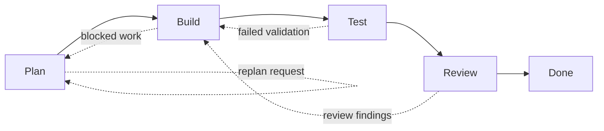

# Orchex

Orchex is a Codex-first workflow-governance plugin. It enforces a deterministic `plan -> build -> test -> review` contract with required artifacts, validation gates, stack-aware command detection, and TDD-first execution guidance.

## What it does

Orchex gives Codex a stricter execution contract for engineering work:

- fixed workflow stages
- required artifacts per stage
- fail-closed validation gates
- run-integrity checks
- ownership checks for multi-agent work
- synthetic and realistic E2E test coverage

## V1 scope

- deterministic stage order with no silent step skipping
- required stage artifacts
- stack profile detection for common repo types
- script-backed artifact and transition validation
- controlled replan behavior
- bounded multi-agent role discipline
- adversarial test coverage for bypass attempts

## Plugin structure

```text
plugins/orchex/
  .codex-plugin/plugin.json
  skills/
  scripts/
  assets/
```

Repo-local discovery metadata is defined in:

- `.agents/plugins/marketplace.json`

## Workflow model



## Skills

- `orchex`: main orchestrator skill
- `orchex-planner`: planning stage skill
- `orchex-coder`: build stage skill with TDD rules
- `orchex-tester`: validation stage skill
- `orchex-reviewer`: final review stage skill

## Run artifacts

Orchex expects each governed run to produce files under a run directory such as `.orchex/runs/<run-id>/`.

- `run-metadata.json`
- `plan.md`
- `task-ledger.md`
- `build-log.md`
- `test-report.md`
- `review.md`
- `run-summary.md`

Optional:

- `replan-request.md`
- `approval-note.md`
- `adversarial-eval-report.md`

## Scripts

- `resolve-stack-profile.ps1`: detect build, lint, and test commands
- `validate-artifacts.ps1`: verify required artifacts exist for a stage
- `validate-ownership.ps1`: reject overlapping multi-agent file ownership
- `validate-stage.ps1`: enforce transition rules and gate requirements
- `summarize-run.ps1`: generate a final run summary

## Artifact metadata contract

`run-metadata.json` is the source of truth for run identity and should include:

- `runId`
- `createdAt`
- `orchestrator`

Each required markdown artifact should include a matching `Run ID: <value>` line.

For multi-agent runs, `task-ledger.md` should include ownership lines in this format:

- `Owner: planner | Files: docs/plan.md`
- `Owner: coder | Files: src/app.ts, tests/app.test.ts`

## Install and discovery

Repo-local marketplace metadata is already prepared for this repository:

- [marketplace.json](C:/Users/georg/codex-project/Code-Plugin-Guru/.agents/plugins/marketplace.json)

Expected local discovery path:

1. Codex opens this repository as the workspace root.
2. Codex reads `.agents/plugins/marketplace.json`.
3. The marketplace entry points to `./plugins/orchex`.
4. Codex discovers the plugin manifest at `plugins/orchex/.codex-plugin/plugin.json`.

Live discovery in the Codex UI/runtime is still pending verification.

## Example prompts

- `$orchex Build this feature with strict workflow governance.`
- `$orchex Fix this bug using TDD and do not bypass tests or review.`
- `$orchex Use bounded agent roles with explicit ownership for this task.`

## Validation model

Orchex does not rely on prompt discipline alone. The intended path is:

1. detect the repo stack
2. create run metadata and stage artifacts
3. validate artifact presence and run identity
4. validate ownership declarations
5. validate stage transition and test evidence
6. summarize the run only after review

## Local testing

Run the script test suite:

```powershell
powershell -NoProfile -File .\plugins\orchex\scripts\tests\Run-OrchexScriptTests.ps1
```

Run the synthetic E2E suite:

```powershell
powershell -NoProfile -File .\plugins\orchex\scripts\tests\Run-OrchexE2ETests.ps1
```

The E2E harness covers:

- minimal synthetic Node and Python fixtures
- unsupported-stack fail-closed behavior
- run ID tamper rejection
- ownership-conflict rejection
- more realistic Node and Python mini-repos

## Troubleshooting

See [TROUBLESHOOTING.md](./TROUBLESHOOTING.md) for discovery, validation, ownership, and fail-closed stack-detection issues.

## Limitations

- V1 is Codex-first and does not attempt full cross-provider portability.
- V1 uses local scripts for enforcement rather than an MCP-backed runtime coordinator.
- Approval gates are file-driven and workflow-policy-driven, not UI-native.
