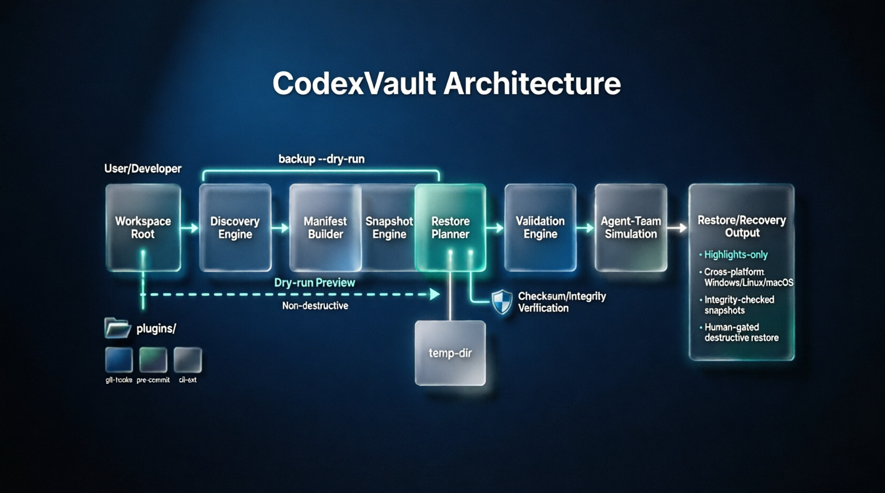
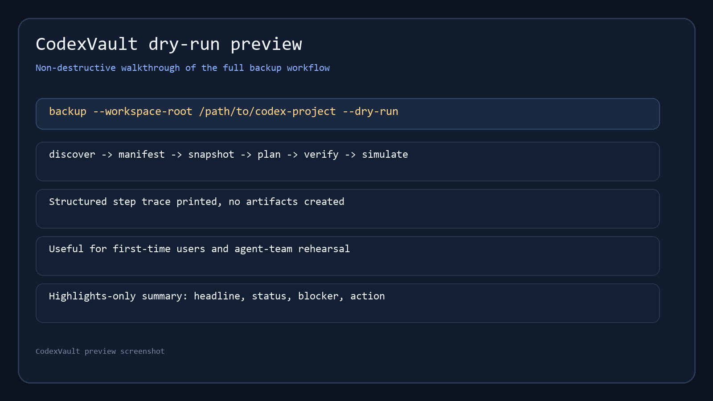
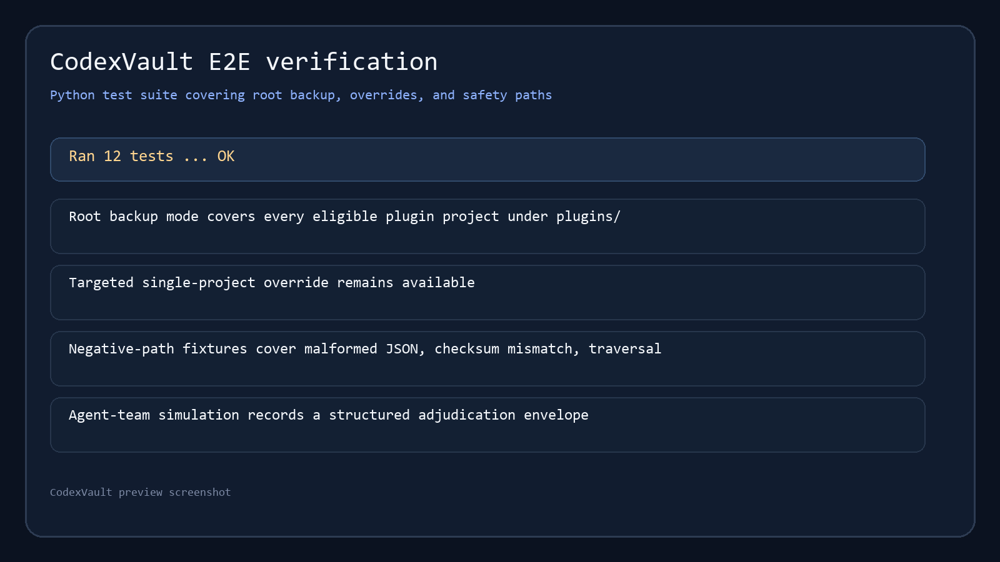

# CodexVault

CodexVault is a Codex recovery intelligence layer for workspace resilience and restoration.

It is not a generic backup tool. It is designed to discover what matters, classify it with confidence, and use human oversight only where uncertainty remains.

It focuses on:
- deterministic cross-platform discovery
- confidence-scored Codex path mapping
- JSON-only review guidance for uncertain paths
- integrity-checked snapshots
- guided restore planning
- harness-first validation
- agent-team-driven simulation and quality assurance

## What’s New in v1b

The latest v1b discovery-intelligence work makes CodexVault feel less like archive management and more like recovery planning:

- verified path mapping now covers Windows Desktop, Windows CLI, WSL Ubuntu, and disposable Linux container surfaces
- Codex-critical state is discovered beyond project folders, including cache, local profile data, plugins, skills, and restore-sensitive paths
- low-confidence path candidates are surfaced with embedded JSON review guidance so humans can confirm or reject only the uncertain parts
- review-band paths are automatically excluded once verified or rejected, so they do not keep reappearing
- dry-run output stays the canonical review artifact, keeping the flow simple and testable

## Security & Privacy

CodexVault redacts secrets by default and does not expose sensitive content in dry-run preview output. It is designed to keep archived provenance minimal and non-secret, with destructive restore actions always requiring human approval.

## Install in Codex

To install CodexVault in Codex from this repository:

1. Clone or download the repo.
2. Keep the plugin under `plugins/codexvault/`.
3. Make sure the plugin manifest exists at `plugins/codexvault/.codex-plugin/plugin.json`.
4. Open Codex and load or discover the plugin from the local repo.
5. Run the CLI from the repo root with the commands below.

If you package the plugin for distribution later, keep the same plugin name and manifest shape so Codex can discover it consistently.

## One-command experience

The first-stop user experience is dry-run preview:

```bash
python plugins/codexvault/codexvault.py backup --workspace-root /path/to/codex-project --dry-run
```

Dry-run:
- previews the full backup workflow
- prints a structured step trace
- creates no artifacts
- redacts secrets and sensitive details from preview output
- helps new users understand what will happen before a real run
- gives agent-team a safe simulation surface

The real backup command uses the same CLI:

```bash
python plugins/codexvault/codexvault.py backup --workspace-root /path/to/codex-project
```

## Screenshots

### Architecture diagram



### Dry-run preview



### E2E verification



## What it does

- discovers workspace and environment state
- generates normalized manifests
- creates integrity-checked snapshot artifacts
- produces restore plans and validation reports
- simulates restore workflows with Codex agent-team orchestration

## User flow

1. Run `backup --dry-run` to preview the workflow.
2. Run `backup` to create real artifacts.
3. Review restore planning and validation output.
4. Use `simulate` to rehearse restore workflows safely.
5. Approve any destructive restore action only after review.

## CLI commands

- `discover`
- `manifest`
- `snapshot`
- `plan`
- `verify`
- `simulate`
- `backup`

## Backup modes

- `backup --workspace-root` backs up every eligible plugin project under `plugins/`
- `backup --workspace` backs up one targeted project when you need a narrower run

## MVP rules

- secrets are redacted by default
- destructive restore actions require human approval
- temp-dir partial restore is isolated and plugin-managed
- scheduling is out of MVP
- validation is tiered and does not overstate restore success
- agent-team simulation is part of the product value proposition
- the user-facing workflow is Python-based and OS-neutral

## Output style

CodexVault keeps user-facing output compact:
- one-line headline
- short status
- one blocker or risk
- one required action, if needed

## Repository layout

```text
plugins/codexvault/
  .codex-plugin/plugin.json
  README.md
  LICENSE
  scripts/
  skills/
  tests/
.github/workflows/
  CI for Windows, Linux, and macOS
```

## Release posture

CodexVault is now moving through a `v1b` discovery-intelligence increment: the runtime stays Python-only, but discovery metadata is richer, Linux heuristics are safer, and installer-seeded discovery is workspace-scoped and opt-in by structure rather than by trust.

CodexVault v1a remains the baseline release posture for the original workspace backup flow, with Windows and Linux MVP validation first and macOS coverage introduced through GitHub Actions smoke testing.

Current discovery coverage now includes verified path mapping on:
- Windows Desktop
- Windows CLI
- WSL Ubuntu, as a Windows-hosted Codex CLI surface
- Debian container
- Ubuntu 24.04 container
- Debian 12 container
- Fedora 42 container
- Alpine 3.21 container

The Linux container captures are used as install-tree evidence for common distribution families, with Docker containers treated as disposable validation surfaces rather than persistent environments.

## Support files

- plugin-specific notes: [plugins/codexvault/README.md](plugins/codexvault/README.md)
- design spec: [research/codexvault/plugin-design-spec.md](research/codexvault/plugin-design-spec.md)
- test matrix: [research/codexvault/test-matrix.md](research/codexvault/test-matrix.md)
- security review: [research/codexvault/security-review.md](research/codexvault/security-review.md)
- release checklist: [research/codexvault/release-checklist.md](research/codexvault/release-checklist.md)
